

# Visual Computing Projects
<html lang="en">
<head>
  <meta charset="UTF-8" />
  <meta name="viewport" content="width=device-width, initial-scale=1.0"/>
  
</head>
<body>
	

    

      <h2>Reconstructing 3D language field with in-the-wild images</h2>
      
 Construct a 3D language field with Gaussian Splatting to handle images containing transient objects. The model leverages semantic segmentation and CLIP embeddings to model transient objects in the scene.
      <a href="https://github.com/ruiqixu37/2952X-Final-Project">[Github]</a> <a href="https://drive.google.com/file/d/1plYeHFmX0MkWaqokV5WWmvFjgXElzR9h/view?usp=drive_link">[Report]</a>  
	    
	  <strong> Keywords: </strong> Gaussian Splatting, 3D reconstruction, Segment-Anything, CLIP
	  

    

    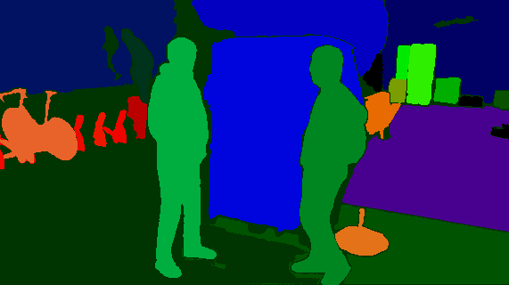
  

  <!-- First Project -->
  

    

      <h2>Procedural landscape generator</h2>
      
 A dynamic scene generator consisting of sky, water, mountains, and terrains with seasonal changes
      <a href="https://github.com/szhan227/CSCI2230FinalProject">[Github]</a>
	    
	  <strong> Keywords: </strong> Procedural Modeling, GLSL
	  

    

    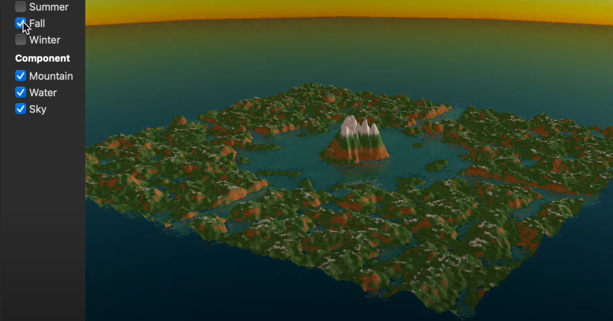
  

  <!-- Second Project -->
  

    

      <h2>Ray Tracer</h2>
      
 Ray tracer based on Phong shading model. The ray tracer supports reflection, refraction, and shadows, and models various light sources, including point lights, directional lights, and spotlights.
      <a href="https://github.com/BrownCSCI1230/projects-ray-ruiqixu37">[Github]</a>
	    
	  <strong> Keywords: </strong> Ray tracing, Phong shading
	  

    

    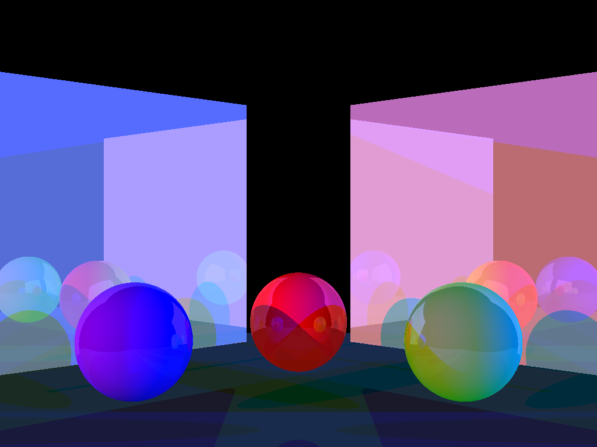
  

  <!-- Third Project -->
  

    

      <h2>Path tracing</h2>
      
 Physically-based path tracer that simulates global illumination, caustics, and soft shadows. The path tracer supports various materials, including Lambertian, specular, and refractive materials.
      <a href="https://github.com/brown-cs-224/path-ruiqixu37">[Github]</a>
	    
	  <strong> Keywords: </strong> Path tracing, physically-based rendering
	  

    

    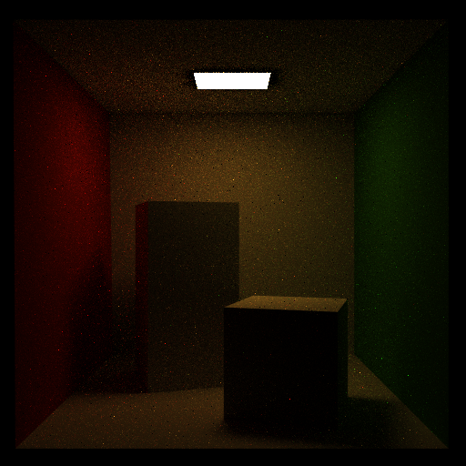
  

  

    

      <h2>As-Rigid-As-Possible Surface Modeling</h2>
      
 A system for user-interactive deformation of 3D meshes. In the system, mesh vertices can be re-positioned by clicking and dragging. The system will update the rest of the mesh in response to these user interactions such that it moves as-rigidly-as-possible.
      <a href="https://github.com/brown-cs-224/arap-ruiqixu37">[Github]</a>
	    
	  <strong> Keywords: </strong> Optimization, mesh deformation
	  

    

    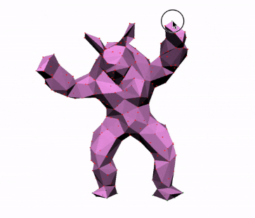
  

  

    

      <h2>Geometry Processing (Mesh) </h2>
      
 Implementations of various geometry processing algorithms on triangular meshes, including Loop subdivision, quadric error simplification, and isotropic remeshing.
      <a href="https://github.com/brown-cs-224/mesh-ruiqixu37">[Github]</a>
	    
	  <strong> Keywords: </strong> Geometry processing, mesh simplification, mesh remeshing
	  

    

    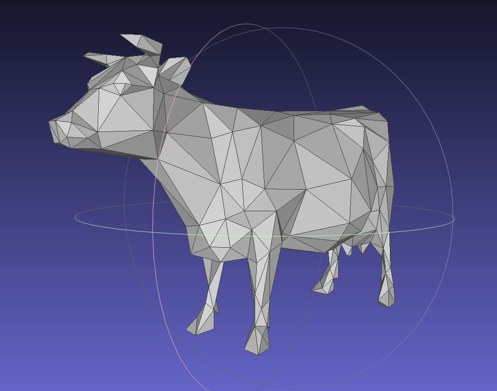
  

  

    

      <h2>Interactive brush painting interface</h2>
      
 A 2D drawing board that allows users to paint with different brush styles and colors. The brush effects are implemented through multiple filters (e.g., constant, linear, quadratic, cubic, and sinusoidal) and color blending modes.
      <a href="https://github.com/BrownCSCI1230/projects-1-and-2-brush-and-filter-ruiqixu37">[Github]</a>
	    
	  <strong> Keywords: </strong> OpenGL, filters, color blending, GUI
	  

    

    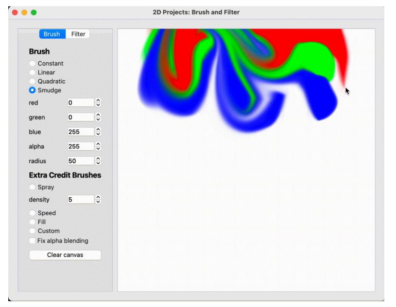
  

  

    

      <h2>Finite Element Simulation </h2>
      
 Animate deformable solid objects using the finite element method. The project supports essential features such as force computation, time integration, and collision response.
      <a href="https://github.com/brown-cs-224/fem-ruiqixu37">[Github]</a>
	    
	  <strong> Keywords: </strong> Finite element method, animation
	  

    

    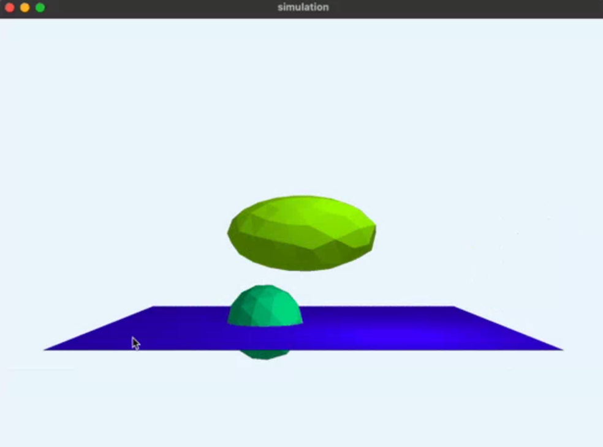
  

</body>
</html>

# Other Experiences

<html lang="en">
<head>
  <meta charset="UTF-8" />
  <meta name="viewport" content="width=device-width, initial-scale=1.0"/>
  
</head>
<body>
  <!-- First Project -->
  

    

      <h2>Generalized Category Discovery</h2>
      
Semi-Supervised Deep Clustering for Generalized Category Discovery. I worked with Patrick Feeney and Prof. Michael Hughes on this project in Spring 2023.
      <a href="https://github.com/tufts-ai-robotics-group/ImbalancedGCD">[Github]</a>

    

    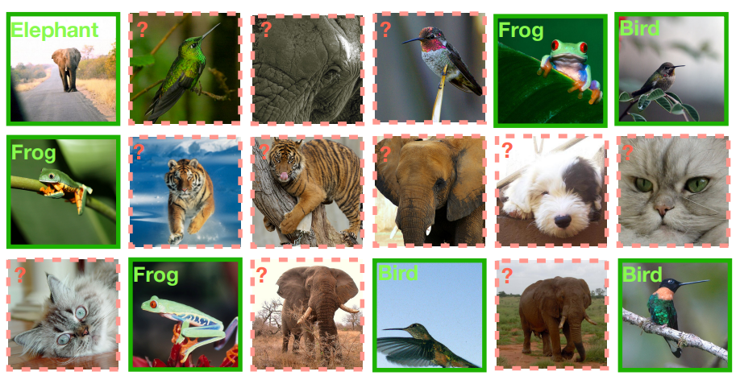
  

  <!-- Second Project -->
  

    

      <h2>Kriging Convolutional Networks</h2>
      
Optimized PyTorch implementation of Kriging Convolutional Networks. I finished this project under the supervision of Prof. Liping Liu in Fall 2022.
      <a href="https://github.com/tufts-ml/kcn-torch">[Github]</a>

    

    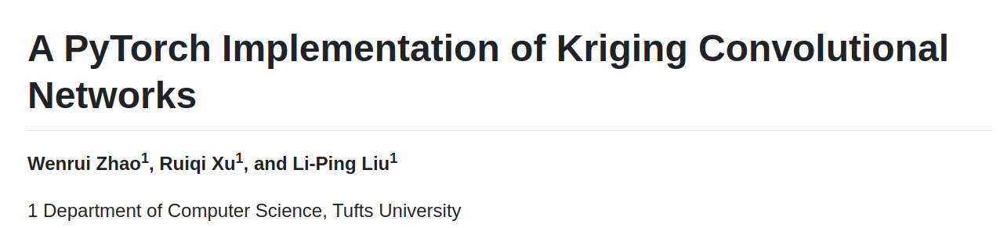
  

  <!-- Third Project -->
  

    

      <h2>Citadel DataOpen Summer Invitational</h2>
      
Second place winner of virtual, one-week datathon hosted by Citadel in Summer 2021.
      <a href="https://github.com/ruiqixu37/2021-Citadel-Datathon">[Github]</a>

    

    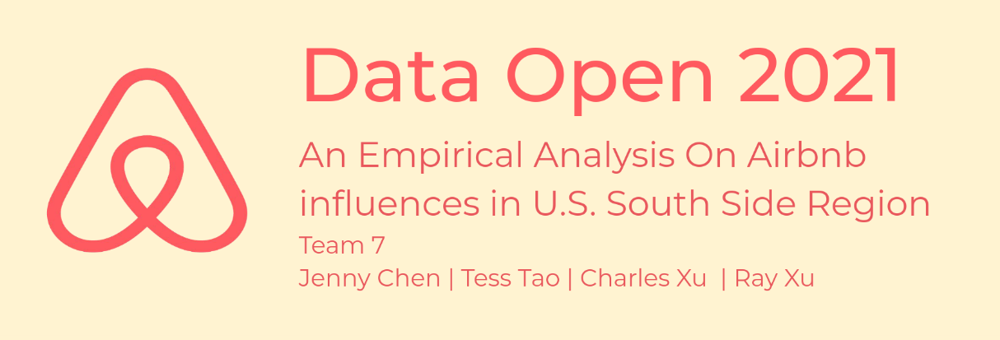
  

</body>
</html>

